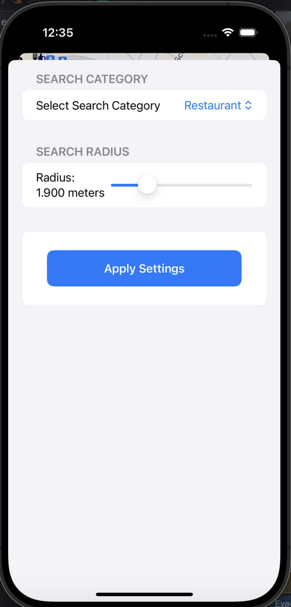

# 

**Claim Your Spot, Anytime, Anywhere.**

ReserveIt is an intuitive app designed to simplify the process of reserving spots at local businesses, such as restaurants, cinemas, and other venues. It caters to users who want to easily book or reserve spots without the hassle of phone calls or manual reservations. ReserveIt stands out by providing a seamless user experience, real-time availability updates, and integration with a variety of local businesses.

## Target Audience

ReserveIt is ideal for anyone who frequently visits restaurants, cinemas, or other venues requiring reservations. It is especially beneficial for busy individuals who value convenience and efficiency in their daily lives.

## Problem Solved

ReserveIt resolves the common issues associated with reservations, eliminating the need for lengthy phone calls and dealing with unavailable spots. Users can view and secure available spots in real-time, ensuring a smooth and hassle-free booking experience.

## Unique Selling Proposition

ReserveIt distinguishes itself through its comprehensive coverage of local businesses, real-time availability updates, and an intuitive user interface that streamlines the reservation process.

## Planned Design

  
  
  
  
  

## Features

- Real-time updates for local businesses
- Seamless reservation process for restaurants and cinemas
- User-friendly interface with intuitive navigation
- User profile management
- Reservation history and management
- User reviews and ratings for businesses

## Project Structure

- **Model:** Contains data models.
- **View:** Contains SwiftUI views.
- **ViewModel:** Contains view models handling business logic.
- **Repository:** Handles data fetching and storage.

## Data Storage

- **Firebase**: Used for user authentication and data management.
- **Core Data**: Used for local data management.

## API Calls

- [Google Places API](https://shorturl.at/tZiP4)

## 3rd-Party Frameworks

- **Firebase**: For authentication and data management.
- **Google Maps SDK**: For integrating maps functionality.
- **Core Data**: For local data management.

## Outlook

- Integration with more types of businesses (gyms, spas, etc.)
- Advanced search filters
- Social sharing options
- Loyalty programs and discounts for frequent users
- Make Own API for Data transmission and Reservation Process
